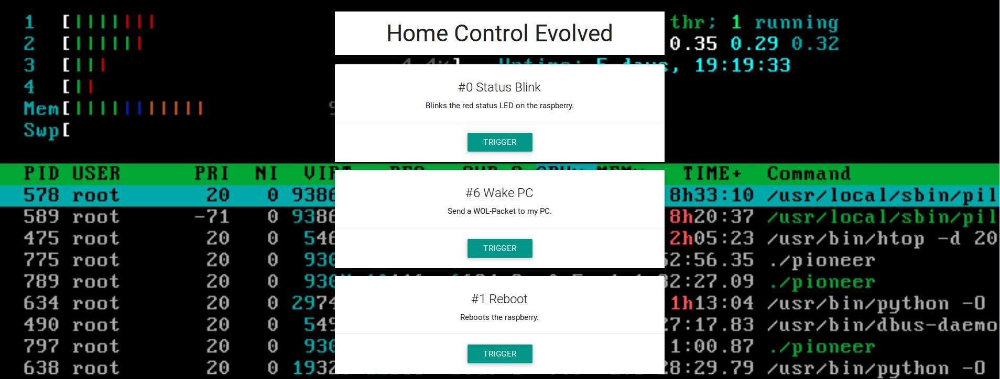
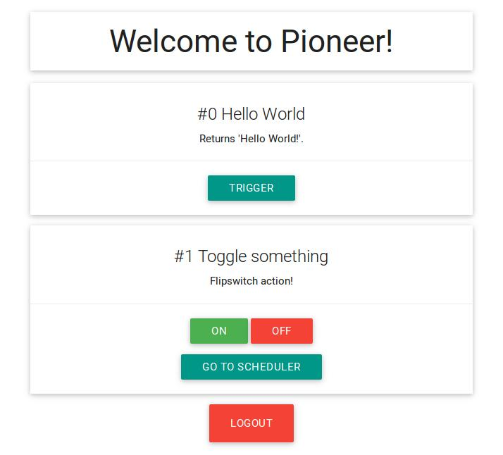

# Pioneer

### Problem

Building your own IoT devices is fun and often helps you solve real world problems. Controlling them often involves writing small applications and scripts that execute certain functions. That's all great, but at some point you probably want to get away from using a command line interface to call all your amazing Python-/Bash-/Whatever-Scripts.

### Meet Pioneer

A simple, reactive and secure web interface to call command line functions from everywhere, simple and intuitive!

### Features

* Single configuration file
* Clean, modern user interface
* User accounts
* SSL encryption out of the box
* One-time and toggle commands supported
* Schedule your commands to run at certain times
* Low performance requirements, runs perfectly on a Raspberry Pi
* Batteries included, single binary deploy (plus config.json)!

### Installation

Download the version matching your device/system below, create a file called `config.json` in the same directory (tip: copy and paste the example config from this repository to get the basic structure) and execute the binary! For best results, set it up so that the binary is executed at startup.

Alternatively, if you have a Go compiler installed you can just call `go get -v -u github.com/PiMaker/Pioneer`

### Download

| [darwin (32 bit)](static/Pioneer-darwin-10.6-386)        |
| [darwin (64 bit)](static/Pioneer-darwin-10.6-amd64)      |
| [linux (32 bit)](static/Pioneer-linux-386)               |
| [linux (64 bit)](static/Pioneer-linux-amd64)             |
| [linux (ARM v5)](static/Pioneer-linux-arm-5)             |
| [linux (ARM v6)](static/Pioneer-linux-arm-6)             |
| [linux (ARM v7)](static/Pioneer-linux-arm-7)             |
| [linux (ARM64)](static/Pioneer-linux-arm64)              |
| [linux (MISP64)](static/Pioneer-linux-mips64)            |
| [linux (MIPS64le)](static/Pioneer-linux-mips64le)        |
| [Windows (32 bit)](static/Pioneer-windows-4.0-386.exe)   |
| [Windows (64 bit)](static/Pioneer-windows-4.0-amd64.exe) |

Thanks [XGo](https://github.com/karalabe/xgo)!

### Configuration

Look at the file `config.json` in this repository's root folder for documentation and an example.

### Screenshots

Note: To get the amazing `htop` background image, you have to use the live background feature. Don't ask me how exactly I set it up though, this was one of those "it's almost midnight I want to do something fun" ideas, it quickly turned into a garbled mess though (as one would expect).

### License

This project is licensed under the MIT License. Look at [LICENSE](LICENSE) for further details.